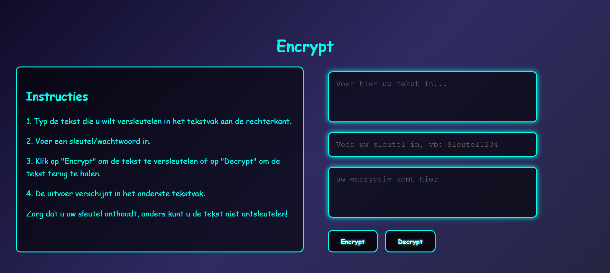

# Symmetrische Encryptie Webapp

Een eenvoudige webapplicatie waarmee gebruikers **tekst lokaal kunnen versleutelen en ontsleutelen** met een wachtwoord/sleutel, gebaseerd op symmetrische encryptie (AES-256).

---

## Live Demo

*(Voeg hier je live demo link toe, bijvoorbeeld via GitHub Pages)*

  
*Screenshot van de app – vervang `screenshot.png` door je eigen afbeelding*

---

## Functionaliteiten

- Tekst versleutelen en ontsleutelen met een wachtwoord.
- Retro-neon interface, responsive design.
- Instructies direct zichtbaar naast de app.

---

## Encryptiemethoden

- **Algoritme:** AES-256 (Advanced Encryption Standard)  
- **Library:** [CryptoJS](https://cryptojs.gitbook.io/docs/)  
- **Reden voor keuze:** AES-256 is veilig, modern en breed getest. Het gebruik van CryptoJS zorgt ervoor dat cryptografie correct en betrouwbaar wordt toegepast in de browser, waardoor we “Don't roll your own crypto” volgen.

**Voorbeeld van encryptie en decryptie in JS:**

```javascript
// Versleutelen
const ciphertext = CryptoJS.AES.encrypt(plaintext, key).toString();

// Ontsleutelen
const bytes = CryptoJS.AES.decrypt(ciphertext, key);
const originalText = bytes.toString(CryptoJS.enc.Utf8);
Sleutelbeheer
Generatie: de gebruiker voert een wachtwoord of sleutel in; dit wordt direct gebruikt als cryptografische sleutel.

Opslag: de sleutel wordt niet opgeslagen in de app of server. Alles gebeurt lokaal.

Uitwisseling: de gebruiker moet de sleutel zelf veilig delen met anderen indien nodig.

Beveiligingsimplicaties: verlies van de sleutel betekent verlies van toegang tot de versleutelde tekst. Dit volgt de standaardprincipes van symmetrische encryptie.

##Kerckhoffs Principe
Kerckhoffs Principe stelt dat een versleutelingssysteem veilig moet zijn, zelfs als alle details van het systeem bekend zijn, behalve de sleutel.

In deze app is de code volledig publiek: iedereen kan zien hoe encryptie werkt.

De veiligheid hangt volledig af van de geheimhouding van de sleutel.

Zelfs met volledige kennis van de app kan een aanvaller de tekst niet ontsleutelen zonder de sleutel.

##Gebruik
Typ de tekst die je wilt versleutelen in het tekstvak.

Voer een wachtwoord of sleutel in.

Klik op Encrypt om te versleutelen of Decrypt om te ontsleutelen.

De uitvoer verschijnt in het onderste tekstvak.

Tip: onthoud je sleutel, anders kun je de tekst niet terughalen.

##Installatie
Clone de repository:
git clone https://github.com/jouw-gebruikersnaam/naam-van-je-project.git
cd naam-van-je-project
Installeer afhankelijkheden:


npm install
Start een lokale server en open de app in je browser:


npx live-server

##Structuur 
.
├── index.html       # Hoofd HTML-bestand
├── style.css        # Stylesheet voor de app
├── app.js           # JavaScript logica
├── package.json     # Node project info
└── node_modules/    # Afhankelijkheden (niet mee tracken in Git)